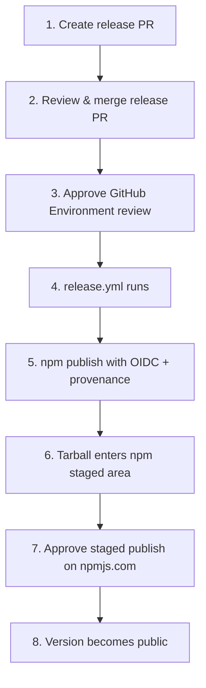

# simple-npm-staged-publish-package-example

A minimal example demonstrating npm **Staged Publishing** with GitHub Actions OIDC Trusted Publishers.

## Overview

This package shows a token-less release flow that requires two human approvals before a version becomes public on npm.

- GitHub Environment protection rule gates the publish workflow
- npm staged publish approval gates the actual promotion to the public registry
- No npm tokens are stored — authentication uses GitHub Actions OIDC
- Provenance attestation is generated automatically

## Release flow



| Step | Where | Actor | Description |
| --- | --- | --- | --- |
| 1 | GitHub Actions | maintainer | Run `create-release-pr.yml` to open a version-bump PR with the `Type: Release` label |
| 2 | GitHub PR | reviewer | Review and merge the release PR |
| 3 | GitHub Environment `npm` | reviewer | Approve the deployment to allow the workflow to start |
| 4 | GitHub Actions | — | `release.yml` runs on the merged PR |
| 5 | npm registry | — | `npm publish` runs with OIDC authentication and provenance |
| 6 | npm registry | — | Tarball is staged (not yet visible to consumers) |
| 7 | npm web UI | maintainer | Approve the staged publish on npmjs.com |
| 8 | npm registry | — | Version is promoted and installable |

## Workflows

### `create-release-pr.yml`

Opens a release PR. Triggered manually with a version-bump type (`patch` / `minor` / `major`). Generates release notes and applies the `Type: Release` label.

### `release.yml`

Publishes to npm when a PR labeled `Type: Release` is merged. Uses `environment: npm` (gated by required reviewers) and `id-token: write` (for OIDC).

## Setup

### 1. npm Trusted Publisher

Go to your npm package's Settings → Trusted Publisher and register GitHub Actions with:

| Field | Value |
| --- | --- |
| Organization / user | Your GitHub user or org |
| Repository | This repository's name (must match exactly) |
| Workflow filename | `release.yml` |
| Environment name | `npm` |

The OIDC token's `repository`, `workflow`, and `environment` claims are checked against these values. A mismatch causes `E401 Unable to authenticate`.

### 2. `package.json` repository URL

`repository.url` in `package.json` must point to the same repository registered with the Trusted Publisher. If it diverges, provenance verification fails with:

```
E422 Failed to validate repository information
```

### 3. GitHub Environment

Create an environment named `npm` (Settings → Environments → New environment) and add required reviewers. This is what gates step 3 of the release flow.

### 4. Repository settings

- Settings → Actions → General → enable **Allow GitHub Actions to create and approve pull requests**
- Create a label named `Type: Release`

## Requirements

- npm CLI ≥ 11.5.1 (OIDC and staged publish support)
- GitHub-hosted runner (self-hosted runners are not supported for provenance)
- Public repository (provenance is not generated for private repos)

## Troubleshooting

| Error | Cause | Fix |
| --- | --- | --- |
| `E401 Unable to authenticate` | Trusted Publisher repo/workflow/environment does not match the OIDC token claims | Align npm Trusted Publisher settings with the actual workflow location |
| `E422 Failed to validate repository information` | `package.json`'s `repository.url` does not match the provenance source | Update `repository.url` to point to the actual repository |
| Workflow does not start after merge | GitHub Environment is awaiting approval | Approve the deployment under the PR's checks or the Actions run page |

## Links

- [npm Trusted Publishing](https://docs.npmjs.com/trusted-publishers)
- [npm Staged Publish](https://docs.npmjs.com/cli/commands/npm-publish#staged-publishes)
- [GitHub OIDC](https://docs.github.com/en/actions/deployment/security-hardening-your-deployments/about-security-hardening-with-openid-connect)
- [Package on npm](https://www.npmjs.com/package/@azu/simple-npm-staged-publish-package-example)

## License

MIT
